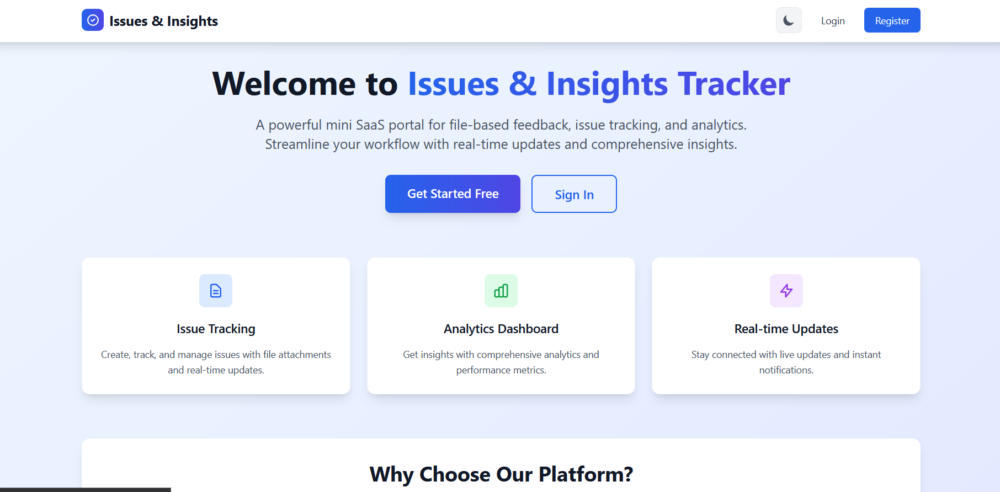
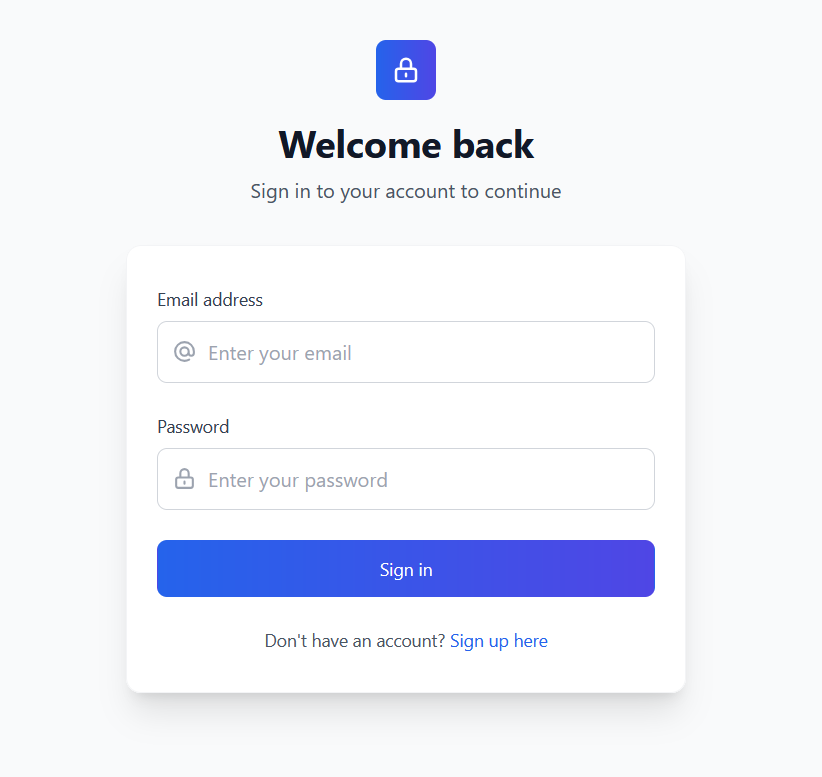
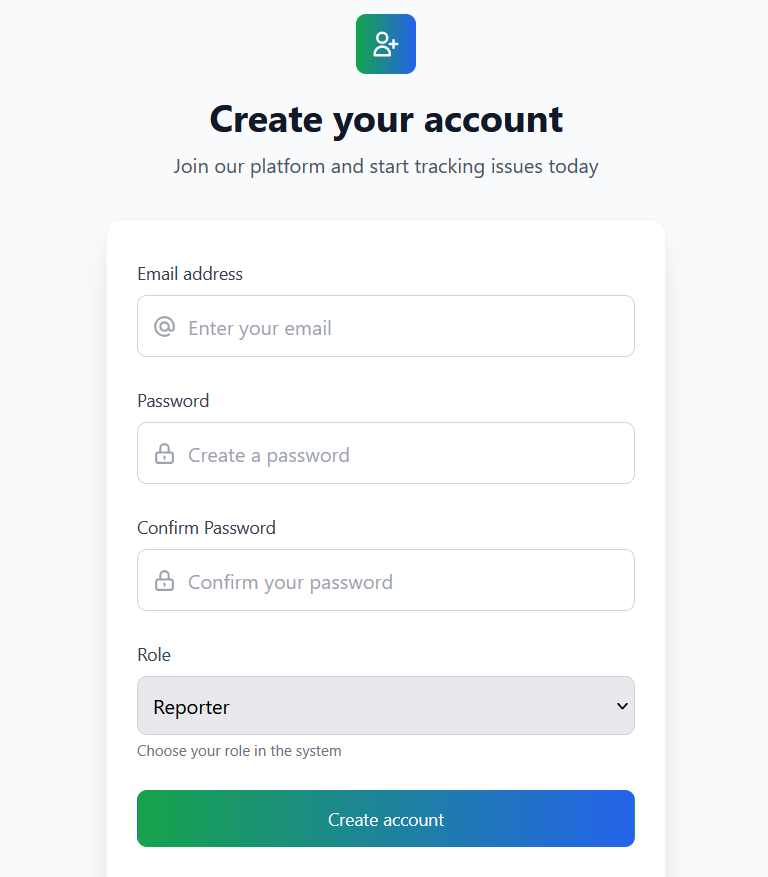
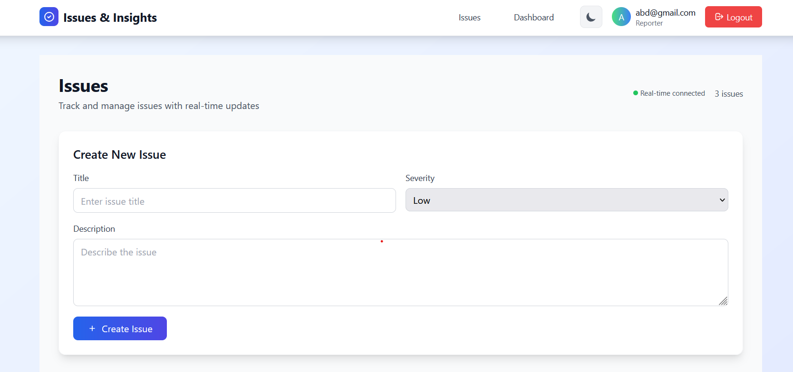
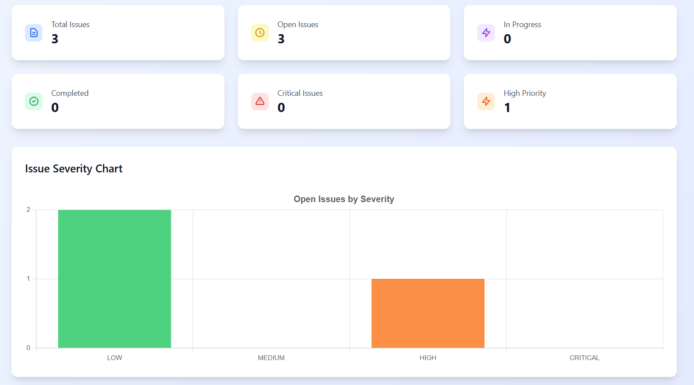

# Issues & Insights Tracker

A mini SaaS portal for issue tracking, feedback, and analytics.

## 📸 Screenshots

<div align="center">
  
  
  
  
  
</div>

## Tech Stack
- **Frontend:** SvelteKit + Tailwind CSS
- **Backend:** FastAPI (Python), SQLAlchemy, Alembic
- **DB:** SQLite (default) or PostgreSQL
- **Worker:** APScheduler (Python)
- **Auth:** JWT, RBAC (ADMIN, MAINTAINER, REPORTER)
- **Realtime:** WebSocket
- **Observability:** Logging, Prometheus metrics
- **Containers:** Docker Compose (web, db, worker)

## Features
- Auth (email/password, JWT)
- Role-based access (RBAC)
- Issue CRUD (Markdown, severity, status workflow)
- Realtime updates (WebSocket)
- Dashboard (open issues by severity)
- Background stats aggregation
- API docs (/api/docs)

---

## 🏗️ Architecture Decision Records (ADR)

### ADR-001: Role-Based Access Control (RBAC) Implementation

**Date:** 2025-01-06  
**Status:** Accepted  
**Context:** The application needed a flexible permission system to manage different user roles and their access to various features.

**Decision:** Implement a three-tier Role-Based Access Control (RBAC) system with the following roles:
- **ADMIN:** Full system access, user management, all CRUD operations
- **MAINTAINER:** Issue management, status updates, limited user operations
- **REPORTER:** Create and view issues, limited to own submissions

**Consequences:**

**Positive:**
- Clear separation of responsibilities
- Scalable permission model
- Easy to extend with new roles
- Frontend and backend enforcement
- Database-level role storage with enum validation

**Negative:**
- Requires role management overhead
- More complex authentication flow
- Need to maintain role consistency across frontend/backend

**Implementation Details:**
- Database: `UserRole` enum in SQLAlchemy models
- Backend: Role checking in FastAPI dependencies
- Frontend: Role-based UI rendering and navigation
- JWT tokens include role information for stateless validation

**Alternatives Considered:**
- Attribute-Based Access Control (ABAC): Too complex for current needs
- Simple admin/user binary roles: Too limiting for future growth
- Permission-based system: More granular but harder to manage

---

## 🚀 Quickstart: Manual (Local) Setup

### 1. **Clone the repo**
```sh
git clone <your-repo-url>
cd "issue tracker"
```

### 2. **Set up environment variables**
- Copy `env.example` to `.env` and fill in values as needed:
```sh
cp env.example .env
```

### 3. **Backend**
```sh
cd backend
pip install -r requirements.txt
# (Optional) Edit .env for DB/SECRET_KEY
python init_db.py  # Initialize database tables
uvicorn main:app --reload
```
- API: http://localhost:8000
- API docs: http://localhost:8000/api/docs

### 4. **Frontend**
```sh
cd frontend
npm install
npm run dev
```
- App: http://localhost:5173

### 5. **Worker**
```sh
cd worker
pip install -r requirements.txt
python worker.py
```

---

## 🐳 Quickstart: Docker Compose

1. **Copy env file**
   ```sh
   cp env.example .env
   ```
2. **Run everything**
   ```sh
   docker compose up --build
   ```
- App: http://localhost:3000
- API: http://localhost:8000
- API docs: http://localhost:8000/api/docs
- Prometheus metrics: http://localhost:8000/metrics

---

## 📝 Notes
- **.env**: Never commit your real `.env` file. Use `env.example` as a template.
- **DB**: Default is SQLite for dev. For production, set `DATABASE_URL` to PostgreSQL/MySQL in `.env`.
- **RBAC**: Roles are ADMIN, MAINTAINER, REPORTER. Permissions enforced in backend and UI.
- **Realtime**: Uses WebSocket for instant updates.
- **Testing**: See `test_setup.py` and `test_docker.py` for health checks.

---

